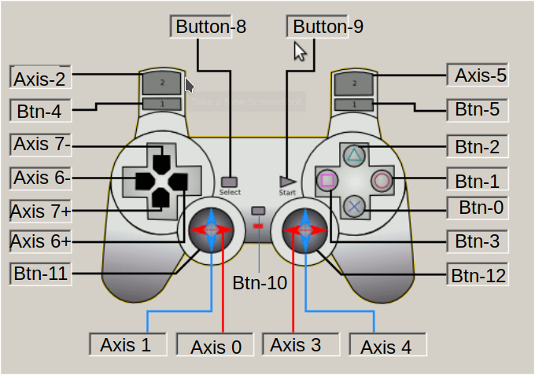

# Cheap PS4 console to MQTT
## Architecture

## Purpose
Ever wanted an easy way to control your IOT devices, this is an easy way forward !
Just buy one of these dirt cheap PS4 wireless controller clones and link it to your project via joystick2mqtt. 

### Scala code
As I wanted a readable way to do the wiring between the sensors 
and the actuators, I developed a small Scala and C++ framework. 
C++ runs on the IoT device, the scala part runs on the Raspberry Pi.
The code and behaviour is similar and reads as a flow of events left to right. 
[tinyAkka Scala ](https://github.com/vortex314/tinyAkka) ,
[nanoAkka  C++](https://github.com/vortex314/nanoAkka)
Ultimate goal is that there is no need of a remote controller, and the fully automated version will be controlled in Scala. 
```
mqtt.from("src/pi3/js0/axis0") >> scale(-32767,+32767,-90,90) >> mqtt.to("dst/robot/steer/angle") 
mqtt.from("src/pi3/js0/axis1") >> scale(-32767,+32767,-4,+4) >> mqtt.to("dst/robot/drive/speed")
mqtt.from("src/pi3/js0/alive") >> negate >> mqtt.to("dst/robot/freeze")
```

### Controls on joystick

### Mqtt spy with 2 controllers - 1 Bluetooth, 1 USB

### Naming convention in MQTT topics
```
src/<host>/<joystick_device>/buttonx => 0 or 1
src/<host>/<joystick_device>/axisx  => -32767 => 32767
```
## Deployment
### Hardware
Install Bluetooth  dongle or use inbuild raspberry pi
### Pair Bluetooth device with Linux
sudo apt-get install bluez libbluetooth-dev
### Build software 
``` 
git clone https://github.com/vortex314/joystick2mqtt
git clone https://github.com/vortex314/Common
git clone https://github.com/eclipse/paho.mqtt.c
cd Common
make -f Common.mk
cd ../paho.mqtt.c
cp ../joystick2mqtt/makePaho.sh
./makePaho.sh
cd ../joystick2mqtt
cp makePaho.sh ../paho.mqtt.c
make -f joystick2mqtt.mk 
```
### Run it
```
./Debug/joystick2mqtt
```
# Config
8C:41:F2:D2:E5:48  PS4 Host
# remote wakeup
sudo hcitool cc 8C:41:F2:D2:E5:48

# References
- Bluetooth API on Linux http://people.csail.mit.edu/albert/bluez-intro/c404.html
- PS4 protocol : https://www.psdevwiki.com/ps4/DS4-BT
- the simple answer : https://stackoverflow.com/questions/47750204/interface-playstation-dualshock-4-ds4-controller-on-linux-using-c/47909635#47909635- the simple answer
# My PS4 Mac Address
8C:41:F2:D2:E5:48
```
$ hcitool info 8C:41:F2:D2:E5:48

Requesting information ...
        BD Address:  8C:41:F2:D2:E5:48
        OUI Company: RDA Technologies Ltd. (8C-41-F2)
        Device Name: Wireless Controller
        LMP Version: 4.2 (0x8) LMP Subversion: 0x1450
        Manufacturer: Actions (Zhuhai) Technology Co., Limited (992)
        Features page 0: 0xbf 0xfe 0x8d 0xfe 0xdb 0xfd 0x7b 0x87
                <3-slot packets> <5-slot packets> <encryption> <slot offset> 
                <timing accuracy> <role switch> <sniff mode> <RSSI> 
                <channel quality> <SCO link> <HV2 packets> <HV3 packets> 
                <u-law log> <A-law log> <CVSD> <power control> 
                <transparent SCO> <broadcast encrypt> <EDR ACL 2 Mbps> 
                <EDR ACL 3 Mbps> <enhanced iscan> <interlaced iscan> 
                <interlaced pscan> <inquiry with RSSI> <extended SCO> 
                <EV4 packets> <EV5 packets> <AFH cap. slave> 
                <AFH class. slave> <LE support> <3-slot EDR ACL> 
                <5-slot EDR ACL> <pause encryption> <AFH cap. master> 
                <AFH class. master> <EDR eSCO 2 Mbps> <EDR eSCO 3 Mbps> 
                <3-slot EDR eSCO> <extended inquiry> <LE and BR/EDR> 
                <simple pairing> <encapsulated PDU> <err. data report> 
                <non-flush flag> <LSTO> <inquiry TX power> <EPC> 
                <extended features> 
        Features page 1: 0x01 0x00 0x00 0x00 0x00 0x00 0x00 0x00

```
```

$ sdptool browse 8C:41:F2:D2:E5:48   

Browsing 8C:41:F2:D2:E5:48 ...
Service Name: Wireless Controller
Service Description: Game Controller
Service Provider: Sony Computer Entertainment
Service RecHandle: 0x10001
Service Class ID List:
  "Human Interface Device" (0x1124)
Protocol Descriptor List:
  "L2CAP" (0x0100)
    PSM: 17
  "HIDP" (0x0011)
Language Base Attr List:
  code_ISO639: 0x656e
  encoding:    0x6a
  base_offset: 0x100
Profile Descriptor List:
  "Human Interface Device" (0x1124)
    Version: 0x0100
```

```
$bluetoothctl 
scan on
agent on
[NEW] Device 8C:41:F2:D2:E5:48 Wireless Controller
[CHG] Device 8C:41:F2:D2:E5:48 Connected: yes
[CHG] Device 8C:41:F2:D2:E5:48 UUIDs: 00001124-0000-1000-8000-00805f9b34fb
[CHG] Device 8C:41:F2:D2:E5:48 UUIDs: 00001200-0000-1000-8000-00805f9b34fb
[CHG] Device 8C:41:F2:D2:E5:48 ServicesResolved: yes
[CHG] Device 8C:41:F2:D2:E5:48 Paired: yes
```

bluetoothctl
devices
scan on
pair 34:88:5D:51:5A:95 (34:88:5D:51:5A:95 is my device code,replace it with yours)
trust 34:88:5D:51:5A:95
connect 34:88:5D:51:5A:95

lieven@pi3:~ $ hciconfig -a
hci0:   Type: Primary  Bus: UART
        BD Address: B8:27:EB:A2:FE:A1  ACL MTU: 1021:8  SCO MTU: 64:1
        UP RUNNING PSCAN 
        RX bytes:6438 acl:10 sco:0 events:193 errors:0
        TX bytes:2630 acl:10 sco:0 commands:127 errors:0
        Features: 0xbf 0xfe 0xcf 0xfe 0xdb 0xff 0x7b 0x87
        Packet type: DM1 DM3 DM5 DH1 DH3 DH5 HV1 HV2 HV3 
        Link policy: RSWITCH SNIFF 
        Link mode: SLAVE ACCEPT 
        Name: 'pi3'
        Class: 0x000000
        Service Classes: Unspecified
        Device Class: Miscellaneous, 
        HCI Version: 4.1 (0x7)  Revision: 0x1ed
        LMP Version: 4.1 (0x7)  Subversion: 0x2209
        Manufacturer: Broadcom Corporation (15)

lieven@pi3:~ $ hcitool dev
Devices:
        hci0    B8:27:EB:A2:FE:A1
lieven@pi3:~ $ bluetoothctl   
[bluetooth]# show
No default controller available
